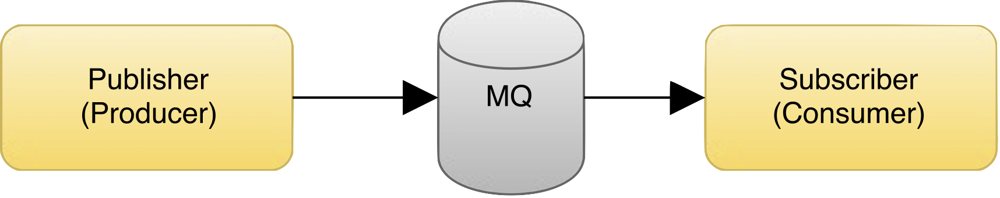

# [fit] Queueing

### [fit]and the QPush Bundle

---

# PubSub Message Queue



---

# PubSub MQ Benefits

- Jobs can be non-blocking, improving performance
- Pubs/Subs/Queues can be scaled independently
- Architectural separation of concerns
- Programming language agnostic

---

# Example use cases for MQ

- Report generation
- Sending Emails
- Fetching data from third-party APIs
- Anything intensive

---

# MQ Considerations

- Extra technology to install, monitor, maintain and learn
- Licence/usage cost
- Redundancy
- Speed
- Delivery confirmation
- Security
- Platform stability/compatibility
- Community support

---

# MQ Solutions

- Self hosted
- Active MQ
- RabbitMQ
- Beanstalk
- Open source
- Cloud Hosted
- IronMQ
- Amazon SQS
- WebSphereMQ
- Commercial
- Cloud AMQP
- Storm
- RackSpace

---

# QPush Bundle with IronMQ

- Easy to use and integrate with Symfony
- Already in use on the project
- Offers an abstraction layer on top of several queues
	- AWS SNS
	- IronMQ
	- Sync _(Immediately dispatch and resolve queued events)_
	- File _(maybe useful for debugging or dev?)_
	- Custom _(Implement the ProviderInterface)_

---

# QPush Instalation

Require the package

```
$ composer require uecode/qpush
```

---

# QPush Instalation

Register the bundle

```php
// app/AppKernel.php
public function registerBundles()
{
    $bundles = array(
        // ...
        new Uecode\Bundle\QPushBundle\UecodeQPushBundle(),
    );

    return $bundles;
}
```

---

# QPush Config

```
# app/config/config.yml
uecode_qpush:
    providers:
        ironmq:
            driver:     ironmq
            token:      AbCdEfGhIjKlMnOp
            project_id: 12345678901234567890
            host:       mq-aws-eu-west-1-1
    queues:
        my_queue:
            provider: ironmq
            options:
                push_notifications: true
                messages_to_receive: 3
                message_expiration: 300
                subscribers:
                    - { 
                        endpoint: https://example.com/qpush,
                        protocol: https
                    }
        ...
```

---

# Creating a queue

`$ bin/console uecode:qpush:build`


---

# Publishing a message

### The manual way:

```
$ bin/console uecode:qpush:publish \
'{"userId": 123, "emailType": "welcome_email"}'
```

---

# Publishing a message

```php
class MyController
{
	/** @var ProviderInterface */
    private $queue;

    public function action()
    {
    	$message = ['userId' => 456, 'emailType' => 'welcome_email'];

        $this->queue->publish($message);
    }
}
```

---

# Publishing a message

```xml
<!-- services.xml -->
<?xml version="1.0" ?>
<container >
    <services>
        <service id="my_app.my_controller" class="MyController">
            <argument type="service" id="uecode_qpush.my_queue" />
        </service>
        <!-- other services -->
    </services>
</container>
```

---

# Demo

---

# Consuming a message

### The manual way:

```
$ bin/console uecode:qpush:receive my_queue
```

---

# Consuming a message

### Or with Symfony as a subscriber:

```
# app/config/config.yml
uecode_qpush:
    queues:
        my_queue:
            provider: ironmq
            options:
                push_notifications: true
			    subscribers:
			        - { endpoint: 'https://example.com/qpush?token=%authentication_token%', protocol: https }
```

---

# Consuming a message

```php
class MessageConsumer
{
    private $emailService;

    public function sendEmail(MessageEvent $messageEvent)
    {
        $body = $messageEvent->getMessage()->getBody();

        $userId = $body['userId'];
        $emailType = $body['emailType'];

        $this->emailService->sendEmailToUser($userId, $emailType);
    }
}
```

---

# Tagging a service

```xml
<!-- services.xml -->
<?xml version="1.0" ?>
<container >
    <services>
        <service id="my_app.message_consumer" class="MessageConsumer">
            <tag name="uecode_qpush.event_listener"
            	 event="my_queue.message_received"
            	 method="sendEmail" />
        </service>
        <!-- other services -->
    </services>
</container>
```

---

# Options

```
- queue_name
- push_notifications
- notification_retries
- message_delay
- message_timeout
- message_expiration
- messages_to_receive
- receive_wait_time
- subscribers
- logging_enabled
- cache_service
```

---

# Testing With Behat

- Integration tests - just one or two that actually touch the api.
- For the rest you can use an in-memory simulated queue.

---

# Issues
	
- Qpush bundle clients are not kept up to date.
- Docs aren't always clear.
- Some questionable code, constructor in interface.
- Tests aren't catching errors.
